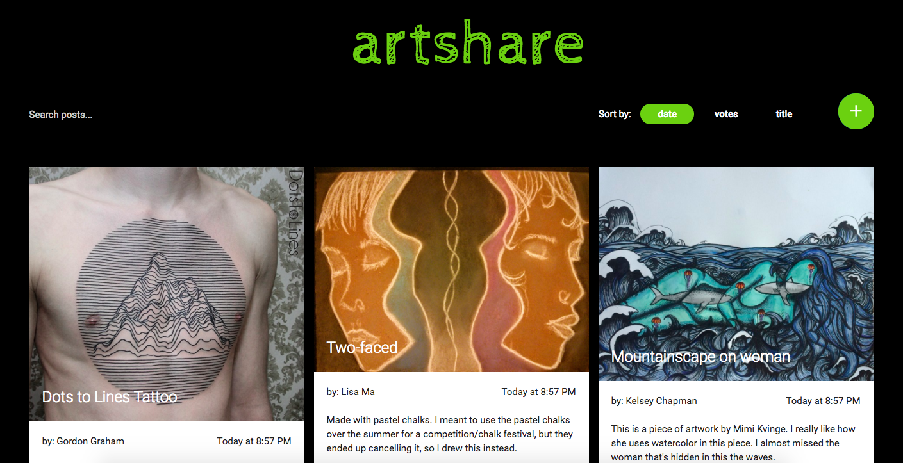
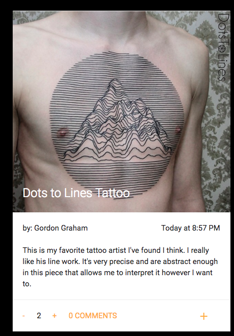
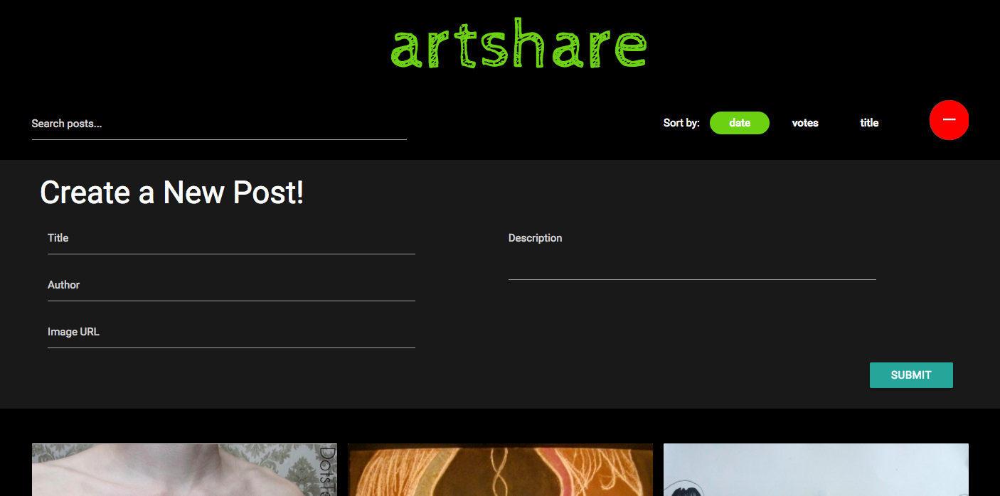

#artshare

What started out as a reddit clone turned into something more pinterest-y. **artshare** is my first Angular app that mimics functionalities found in reddit. It is strictly client-side and utilizes a variety of common Angular directives.

**Try it out yourself here:** http://limawebdev1-artshare.surge.sh/

###Technologies Used
I am using a **Materialize** framework to make it look pretty along with **s-yadav's angulargrid**. It worked great and I recommend checking out his repo here: https://github.com/s-yadav/angulargrid. Other than that, I used **jQuery** for things relevant to Materialize element functionalities and the rest of the dynamic app utilizes **AngularJS**.

###Features
1. A basic grid layout with search and sorting functionalities. You can sort by date, votes, or title.

2. Each post contains an image, a title, the author, a description, upvote and downvote functionality. It allows you to view comments and also add comments.

3. You are also able to create a post.

